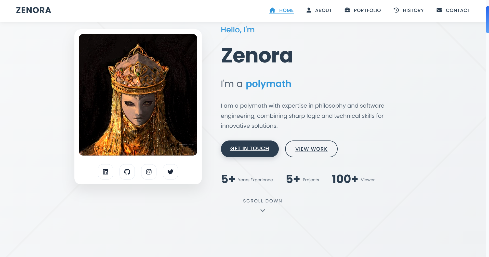
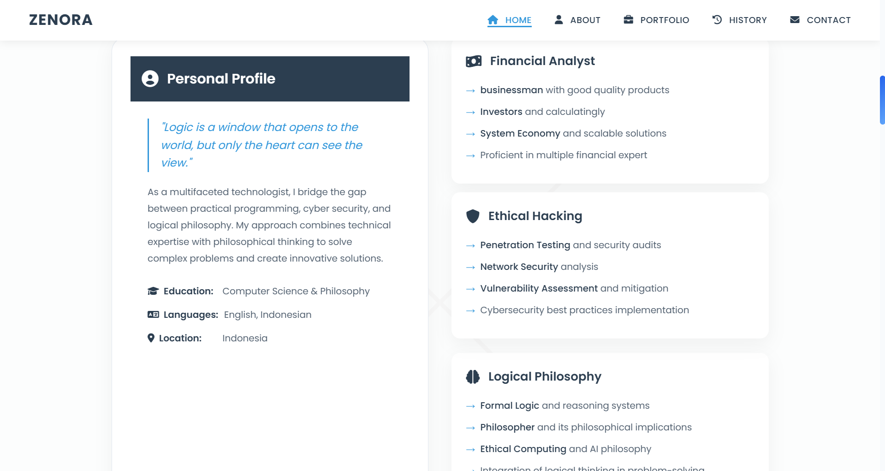
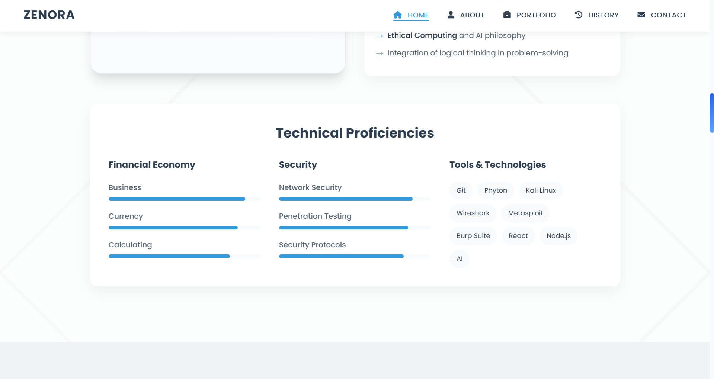

# Zenora - Personal Website

Welcome to **Zenora**, my personal website designed to showcase my projects, skills, and interests in a modern and visually appealing way. Built with **HTML**, **CSS**, and **JavaScript**, this website is a reflection of my creativity and technical skills.

---

## Features
- **Portfolio Section**: Highlighting my past projects and achievements.
- **About Me**: Learn more about who I am and my journey.
- **Responsive Design**: Optimized for all screen sizes, from mobile to desktop.
- **Interactive Animations**: Subtle transitions and hover effects for a polished look.
- **Contact Form**: Allows visitors to get in touch easily.

---

## Live Preview
Check out the live version of the website here:  
[Zenora Website](https://rexzea.github.io/Zenora/)

---

## Technologies Used
- **HTML5**: For the structure and layout.
- **CSS3**: For styling, including gradients and animations.
- **JavaScript**: For interactivity and dynamic elements.

---

## Example




---

## How to Use
1. Clone the repository:
   ```bash
   https://github.com/rexzea/Zenora.git
